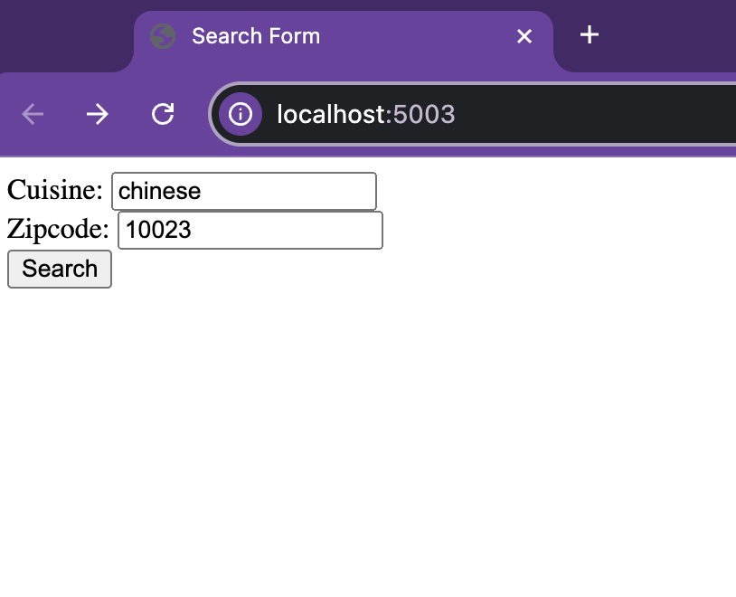

# NYC_Restaurant_Search_Engine
A web application that allows users to search for nearby restaurants in NYC by entering a zip code and selecting a cuisine type. The app provides a list of restaurants and related articles.

### Project Focus
1. Data store and ETL process designs, as well as the Python implementation of the end-to-end data management application
2. An API or an interface for interaction with the application

### Data Source
1. NYC OpenData API: DOHMH New York City Restaurant Inspection Results (~20,000 restaurants)
2. NewsAPI: Food-related news article (~ 23,000 articles)

### Design Choice
1. Employs the “request” library to make an HTTP GET request to APIs:
- NewsAPI to acquire contemporaneous articles on food-related subjects
- NYC Open Data API to obtain detailed restaurant data

2. MongoDB is used to efficiently store and manage the copious amounts of data procured:
- Scalability and flexibility
- Accommodating various data formats
- Enhancing the system’s capability to swiftly retrieve data and scale in response to the expanding dataset

3. Using Flask to construct an interactive, user-centric web interface：
Input cuisine & zip code, Output restaurant recommendations and relevant articles

- Offering a straightforward and robust environment for developing web applications
- Managing specific user inputs and dynamically displaying the corresponding data
- Lightweight and efficient architecture

